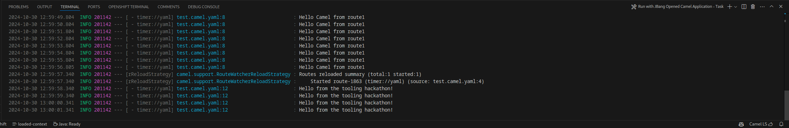

# Apache Camel F2F tooling hackathon ([go back](../README.md))

## Lab 1: Create a Camel Route

The goal of this lab is to create a simple Camel route using the commands available in VS Code, provided by the Extension pack for Apache Camel by Red Hat.

### Prerequisites

* Install [VS code](https://code.visualstudio.com/docs/setup/setup-overview).
* Install the [Extension pack for Apache Camel by Red Hat](https://marketplace.visualstudio.com/items?itemName=redhat.apache-camel-extension-pack) in VS Code.
* Install [JBang CLI](https://www.jbang.dev/documentation/guide/latest/installation.html).

### Instructions
1. Open the command palette by pressing `F1` or `Ctrl + Shift + P` (Windows/Linux) or `Cmd + Shift + P` (Mac).

2. Type `Camel: Create a Camel Route using YAML DSL` and press `Enter`.

3. Type `test` to be the file name and press `Enter`.

4. The new file will be opened with the Kaoto editor.

5. Execute the route by pressing the `Run` button in the top right corner of the editor.

6. The route will be executed and the output will be shown in the terminal.

7. In the route, click on the `setBody` component to open the configuration panel

8. By default, only `Required` properties are shown. Click on the `All` button to show all properties.

9. Change the `expression` property to `Hello from the tooling hackathon!`.

10. Save the file by pressing `Ctrl + S` (Windows/Linux) or `Cmd + S` (Mac) and notice how the route is restarted automatically.

11. Let's replace the `log` EIP with a `log` component. Right click on the `log` EIP, and select `Replace` in the context menu.

12. Write `log` in the search box and select the `Log` component.

13. Save the file by pressing `Ctrl + S` (Windows/Linux) or `Cmd + S` (Mac) and notice how the route is restarted and now it shows the `Exchange` information.

14. Let's configure the `Log` component to show the `Exchange` headers and pretty print the information. Click on the `Log` component to open the configuration panel. In the search box, type `header` and enable the `showHeaders` property.

15. Save the file by pressing `Ctrl + S` (Windows/Linux) or `Cmd + S` (Mac) and notice how the route is restarted and now it shows the empty `Exchange` headers map.

16. Let's add a header to the `Exchange`. Right click on the `log` component to open the context menu and select `Prepend` to add a new EIP before the `log` component.

17. Write `setHeader` in the search box and select the `SetHeader` EIP.

18. Notice how the `SetHeader` EIP is added before the `Log` component and it shows a yellow warning indicating that required properties are missing. Click on the `SetHeader` EIP to open the configuration panel.

19. In the `Expression` field, type `${messageHistory}`.

20. In the `Name` field, type `messageHistory`.

21. Save the file by pressing `Ctrl + S` (Windows/Linux) or `Cmd + S` (Mac) and notice how the route is restarted and now it shows the `Exchange` headers map with the `messageHistory` header.

22. Congratulations! You have created a Camel route using the commands available in VS Code.
