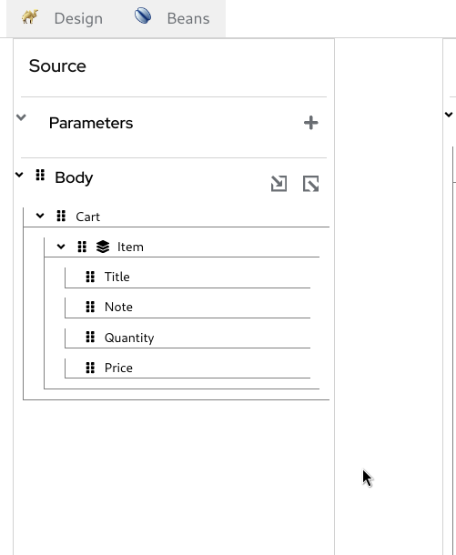
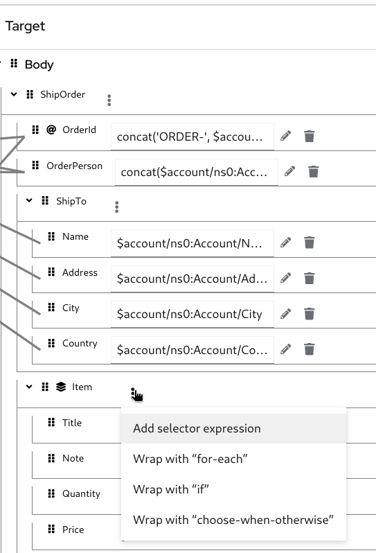

# Apache Camel F2F tooling hackathon ([go back](../README.md))

## Lab 2: Perform a data transformation

The goal of this lab is to perform a data transformation. We will use the Kaoto Data mapper component to showcase how we can easily achieve it using an UI and leveraging the Apache Camel functionality.

We're gonna start from [an existing Apache Camel Route (CreateOrder-template)](CreateOrder-template.camel.yaml) that simulates fetching information from external systems, namely [`Account`](xsd/Account.xsd) and [`Cart`](xsd/Cart.xsd), and then transforming and combining them into a new [`ShipOrder`](xsd/ShipOrder.xsd) format. For this purpose, appropriate XML schemas are provided in the `xsd` folder.

Here's an example of the [`Account`](xsd/Account.xsd) object:
```xml
    <kaoto:Account AccountId="acc001" xmlns:kaoto="kaoto.datamapper.test">
        <Name>Jane Doe</Name>
        <Address>Purkyňova 111, 612 00</Address>
        <City>Brno-Medlánky</City>
        <Country>Česká republika</Country>
    </kaoto:Account>
```

And the [`Cart`](xsd/Cart.xsd) object:
```xml
    <kaoto:Cart xmlns:kaoto="kaoto.datamapper.test">
        <Item>
            <Title>Shadowman T-shirts</Title>
            <Note>XL</Note>
            <Quantity>10</Quantity>
            <Price>25.00</Price>
        </Item>
        <Item>
            <Title>Kaoto T-shirts</Title>
            <Note>L</Note>
            <Quantity>5</Quantity>
            <Price>24.50</Price>
        </Item>
    </kaoto:Cart>
```

The desired output is the [`ShipOrder`](xsd/ShipOrder.xsd) object:
```xml
<ShipOrder xmlns="io.kaoto.datamapper.poc.test"
           xmlns:ns0="kaoto.datamapper.test"
           OrderId="ORDER-acc001-nnnn">
   <OrderPerson>acc001:Jane Doe</OrderPerson>
   <ShipTo xmlns="">
      <Name>Jane Doe</Name>
      <Address>Purkyňova 111, 612 00</Address>
      <City>Brno-Medlánky</City>
      <Country>Česká republika</Country>
   </ShipTo>
   <Item xmlns="">
      <Title>Shadowman T-shirts</Title>
      <Note>XL</Note>
      <Quantity>10</Quantity>
      <Price>25.00</Price>
   </Item>
   <Item xmlns="">
      <Title>Kaoto T-shirts</Title>
      <Note>L</Note>
      <Quantity>5</Quantity>
      <Price>24.50</Price>
   </Item>
</ShipOrder>
```

### Prerequisites

* Install [VS code](https://code.visualstudio.com/docs/setup/setup-overview).
* Install the [Extension pack for Apache Camel by Red Hat](https://marketplace.visualstudio.com/items?itemName=redhat.apache-camel-extension-pack) in VS Code.
* [Install the Kaoto editor extension provided in the `vsix` folder](https://code.visualstudio.com/docs/editor/extension-marketplace#_install-from-a-vsix).
* Install [JBang CLI](https://www.jbang.dev/documentation/guide/latest/installation.html).

### Instructions


### DataMapper screenshots (to be used above)








